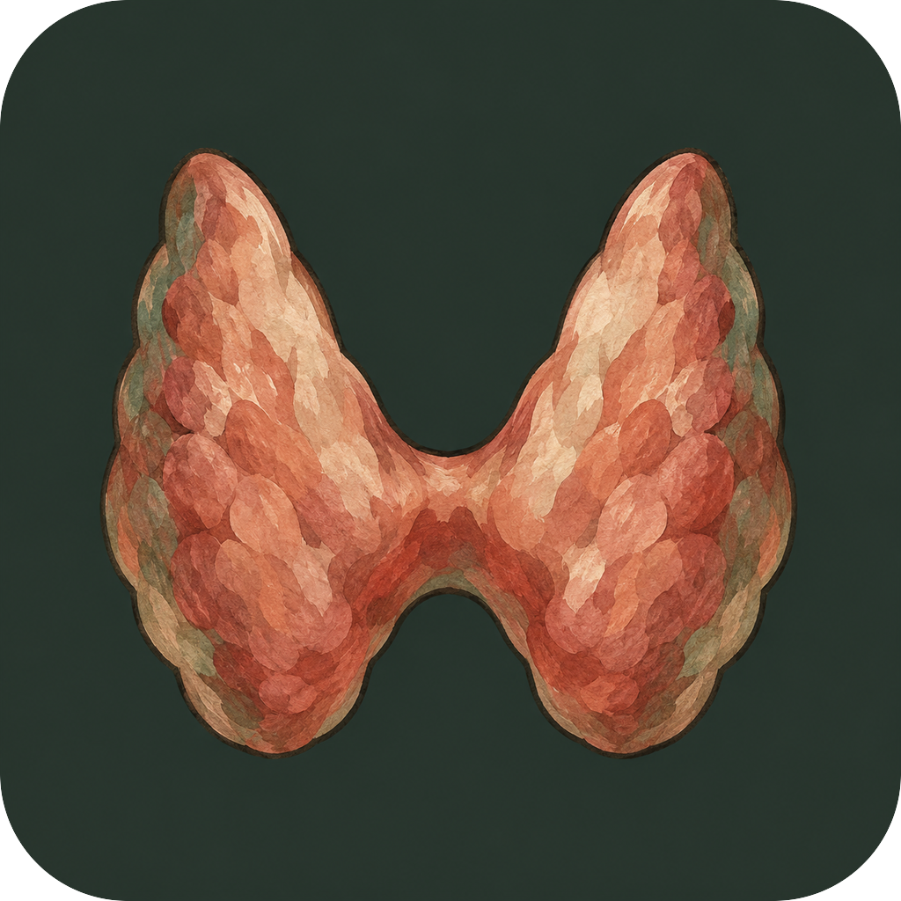

<p align="center">
  <a href="https://sarai-keestra.com">
    
  </a>
</p>



<h3>sarai-keestra.com</h3>

<p>
  <sub>JSON IN, ONE STATIC PAGE OUT</sub>
  <br>
  <strong>Personal site of Sarai Keestra, medical researcher at Amsterdam UMC.</strong>
  <br>
  <br>
  
  <a href="references.bib"></a>
  <a href="#edit-mode-on-the-live-site"></a>
</p>

<br clear="left">

```bash
pnpm build      # content/*.json + references.bib → public/index.html + hashed CSS
pnpm preview    # build, then serve public/ at http://127.0.0.1:4173
```

## Content files

Visible site content lives in these files:

- `content/site.json`
- `content/home.json`
- `content/education.json`
- `content/experience.json`
- `content/science-communication.json`
- `content/publications.json`
- `references.bib`

## Edit mode on the live site

The generated page exposes `window.enableConfigEditMode()`.

- Run `window.enableConfigEditMode()` in the browser console, or open `https://sarai-keestra.com/?edit=1`
- Click any highlighted content block
- The page redirects to the matching GitHub edit URL for that source file

This is meant to let a non-technical editor click the part they want to change and land in the right file directly.
